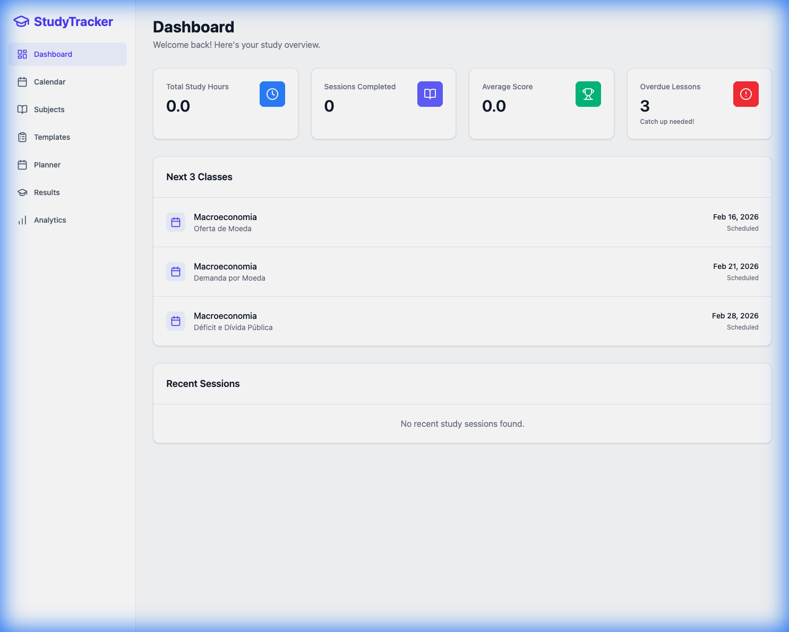
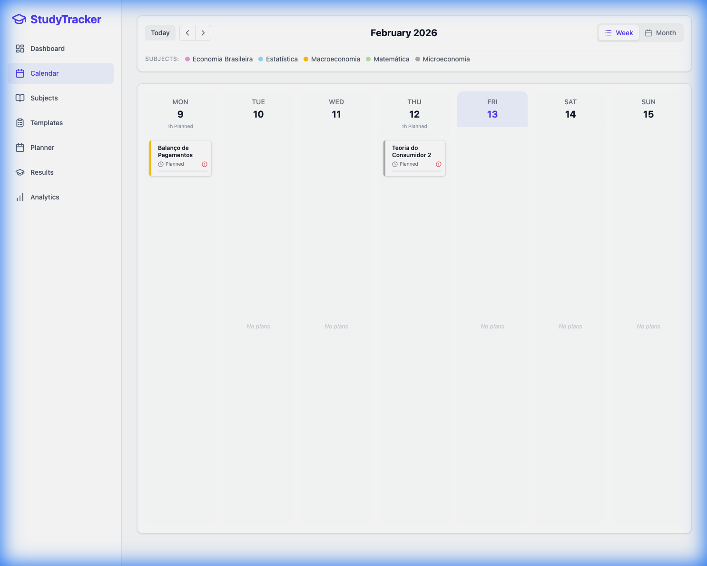

# Study Tracker

[](https://github.com/lpiedade/study-tracker/actions/workflows/test.yml)

A local-first web application for study planning and tracking.

## Features
- **Dashboard**: Overview of progress, study hours, and overdue lessons.
- **Planner**: Manage Lesson Plans and log Study Sessions (Review vs New).
- **Results**: Log and track exam scores.
- **Analytics**: Visualize score trends and study time distribution.
- **Local Persistence**: Uses SQLite (`server/dev.db`).

## Screenshots

### Dashboard


### Calendar


## Prerequisites
- Node.js (v18+)
- npm

## Setup

1. **Install Dependencies**
   ```bash
   cd server && npm install
   cd ../client && npm install
   ```

2. **Database Setup**
   ```bash
   cd server
   # Initialize the database
   npx prisma migrate dev --name init
   # (Optional) Generate client if needed
   npx prisma generate
   ```

## Running the Application

You need to run both the server and client terminals.

**Terminal 1 (Backend):**
```bash
cd server
npm run dev
```
Server runs on [http://localhost:3001](http://localhost:3001).

**Terminal 2 (Frontend):**
```bash
cd client
npm run dev
```
Client runs on [http://localhost:5173](http://localhost:5173).

## Testing
Unit/Integration tests are located in `server/src`.
```bash
cd server
npm test
```
*Note: Ensure `.env` is correctly loaded or database is accessible for tests.*
